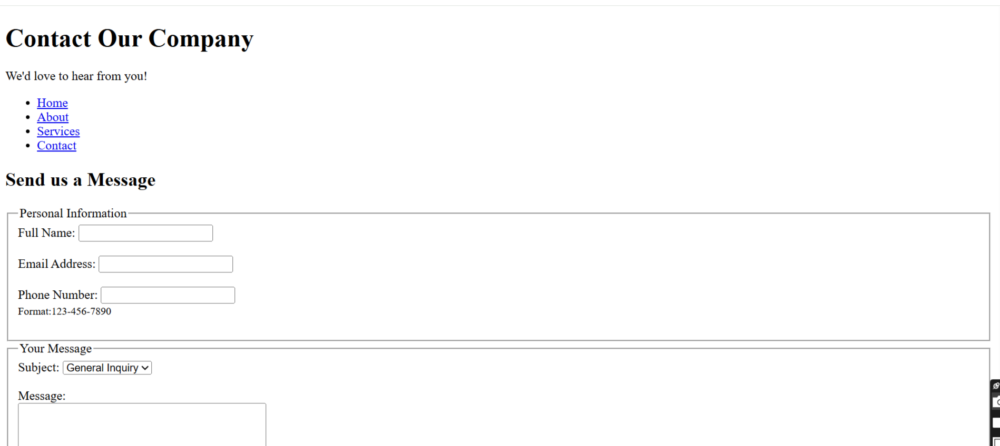
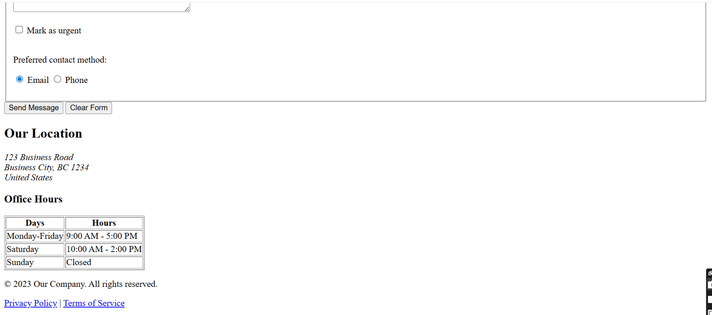

## 📞 **Contact Our Company - Web Page**

### 📝 **Project Overview**

This project is a simple Company Contact Page designed with clean HTML structure. It allows users to easily send messages through a form with fields like name, email, phone, subject, and message.The page also includes options for urgent messages and preferred contact methods. Company information such as office hours and address are clearly displayed. With a menu and footer links, it works as an easy contact page for any business website.

---
### ✨ **Features**

1. Responsive layout using the meta viewport tag

2. Contact form with: Full Name, Email and Phone input

3. Subject selection

4. Message textarea

5. Urgent message checkbox

6. Preferred contact method (Email/Phone)

7. Company location and office hours displayed

8. Navigation menu

9. Footer with links to Privacy Policy and Terms of Service
---

### 🛠️ **Technology Used**

**HTML** –  Provides the structure of the page, defining layout, text, forms, and links.

---
### 💻 **Screenshots**

***

---

### 🚀 **How to Use**

1. Clone the repository:
   
         git clone https://github.com/Wajeeha2004/Task-1-Company-Contact-Page
   
3. Open index.html in any web browser.

---
### 🌐 **Live Demo**

#### 1. Vercel  :        https://task-1-company-contact-page.vercel.app/

#### 2. Netlify :        https://task1-contact-page.netlify.app/

---

### 🙏 **Thanks for Visiting!**

Thank you for checking out this project. Feedback and suggestions are always welcome!

